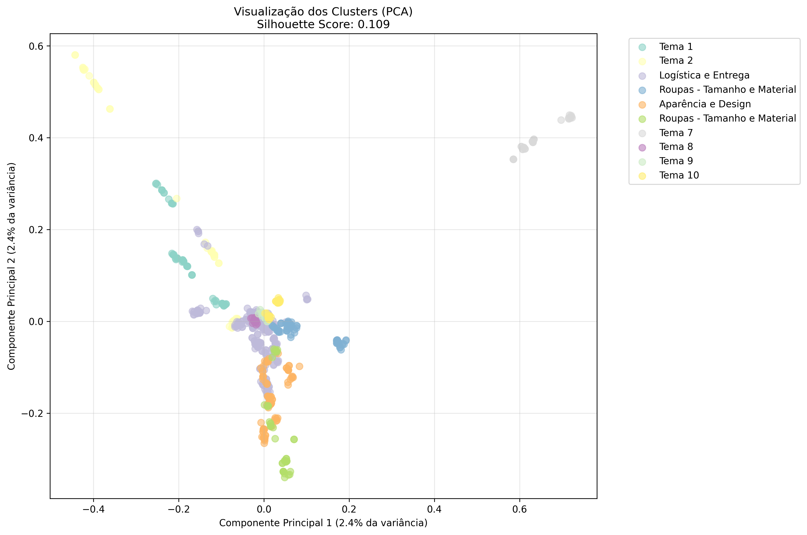
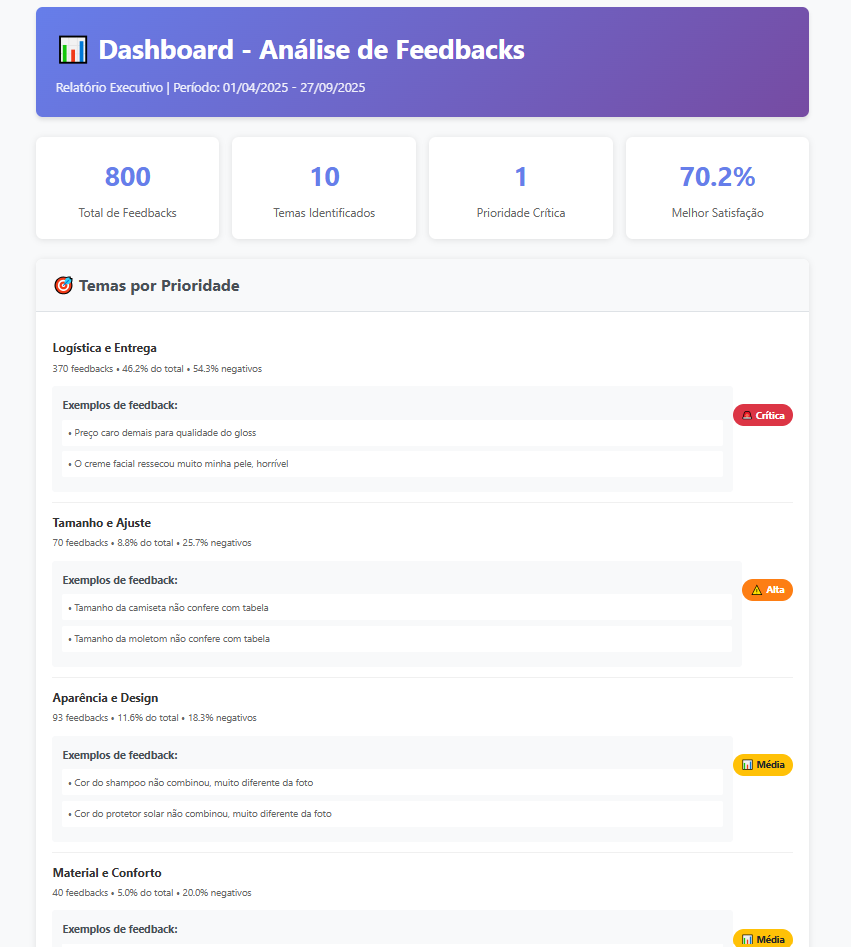

# feedback-analysis-poc

# 🧠 Feedback Analysis POC

Este projeto é uma **Prova de Conceito (POC)** de análise de feedbacks utilizando **clustering temático**.


##  Visão Geral

Este projeto realiza uma **análise de feedbacks de clientes** com foco em:

- **Priorização estratégica** de temas críticos
- **Identificação de oportunidades de melhoria**
- **Dashboard em HTML** com visualização clara e intuitiva


## Funcionalidades

- Geração de dados fakes para execução da POC
- Pré-processamento de texto (limpeza, tokenização, stopwords)
- Vetorização com **TF-IDF**
- Agrupamento por **K-Means**
- Avaliação com **Silhouette Score**
- Extração de palavras-chave por cluster
- Geração de visualizações:
  - Gráfico de distribuição de clusters
  - Wordclouds por tema
  - Tabela comparativa dos clusters
  - Dashboard interativo com **Plotly**
- Exportação de resultados para CSV e PNG
- Dados estratégicos de tendências com análise temporal
- Relatório com os principais insights

### Clusters


### Dashboard


## Instalação do Projeto

Siga os passos abaixo para configurar o ambiente localmente:

```bash
# 1. Clone o repositório
git clone https://github.com/laianemuckler/feedback-analysis-poc.git
cd feedback-analysis-poc

# 2. Crie o ambiente virtual
python -m venv venv

# 3. Ative o ambiente virtual
# No Windows:
venv\Scripts\activate
# No Linux/macOS:
source venv/bin/activate

# 4. Atualize o pip (opcional, mas recomendado)
python -m pip install --upgrade pip

# 5. Instale as dependências do projeto
pip install -r requirements.txt
```
## Observações
Devido ao conhecimento limitado nas bibliotecas e código necessário para essa implementação o Claude foi a IA de apoio utilizada para o desenvolvimento desse projeto.

Essa é apenas uma versão inicial do projeto no qual melhorias já foram identificadas. 

Melhorias identificadas: testar bibliotecas e implementações de código mais adequadas, melhorar a definição dos nomes dos clusters, adicionar análise de sentimento e priorização melhorando o relatório e talvez uma possível substituição da predição, caso as informações quantitativas ligadas a ela não tenham tanto impacto no que diz respeito a análise de feedbacks.
